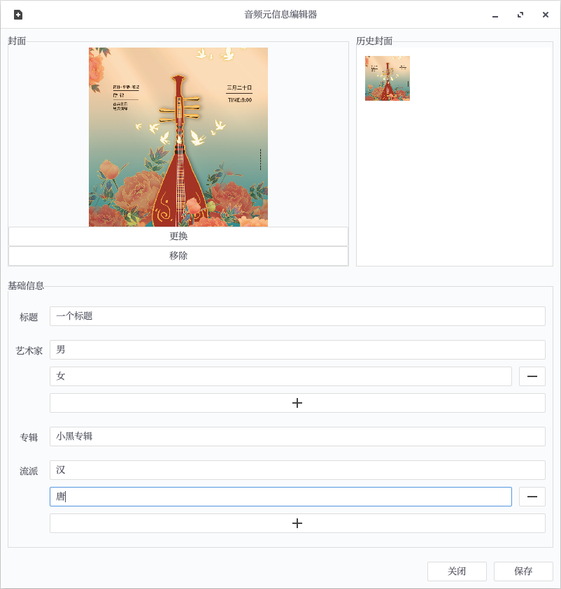

# machoke

音频元信息编辑器，根据我的习惯，只允许编辑少量的信息。

# 截图

# 图标来源

https://icon-icons.com/zh/%E5%9B%BE%E6%A0%87/%E8%8A%B1-%E5%8F%B6-%E5%BC%B9%E7%B0%A7-%E4%BA%AE%E7%82%B9-%E8%8A%B1%E5%9B%AD-%E6%80%A7%E8%B4%A8/153829

# 编译
新版混合Qt和Rust。如果需要本地编译，需要同时具备Qt6和rust工具链。

# 发布协议

AGPL v3
